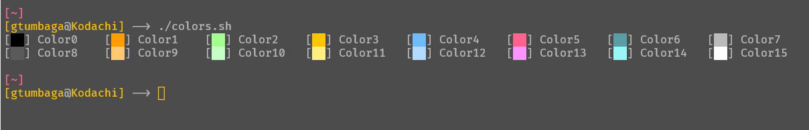
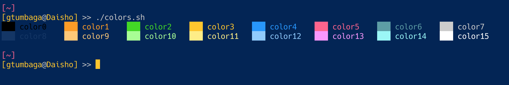

# gConfig
#### These are my various configs, dotFiles, and color themes.

note: this is meant to be cloned to your home directory in ~/gConfig/

This is important becaus the .vimrc file will check and create a symlink form ~/gConfig/g16.vim to ~/.vim/colors/g16.vim if it doesn't exist.


---
## .vimrc and .tmux.conf
Symlink these files from the gConfig dir to your home dir.

## .bashrc_additions
Add this to our .bashrc or .bash_profile file:
```bash
source ~/gConfig/.bashrc_additions
```

## Colors
Please note that the g16.vim color scheme is meant to look good with my custom terminal color scheme.
I've included an iterm and terminal (mac) file to import the colors to your terminal.
For windows, I've also included a .minttyrc for Cygwin, and a ConEmu.xml for ConEmu.

## wsltty / mintty
mintty changed its config file.  this file should now be copied to your windows user dir, in:
```
/mnt/c/Users/<USER>/AppData/Roaming/wsltty/
```
and renamed to just `config`
where of course `<USER>` is your own user<br/>
The `gbaltgraybg.mintty` theme file should be copied to `/themes/`, and renamed just `gbaltgraybg` without any extension.<br/>
Also, I added `/bin/bash -l` to the end of the command in the shortcut to open the terminal, so that it opens correctly in "login mode" so my .bash_profile gets loaded correctly...


### gBaltGrayBG
gBaltGrayBG is my newest color scheme.  I changed the background to a gray, but a lighter color as to not combat the contrast of bright white screens when I'm looking at other windows, and updated some of the other colors to give more of a constrast between light and dark alternatives of a givven color, as well as make them easier to see on the gray background.
I also changed back to the utilization of a terminal background color that is separate from the 16 specified ANSI colors.

Here are the colors used:



| GUI   Color   |  RGB Value   | HEX Value
|--------------:|:-------------|:----------|
| Foreground    |  187,187,187 | #bbbbbb   |
| Background    |  76,76,76    | #4c4c4c   |
| Bold          |  255,255,255 | #ffffff   |
| Selection     |  255,198,0   | #ffc600   |
| Selected Text |  0,0,0       | #000000   |
| Cursor        |  255,198,0   | #ffc600   |

| ANSI Color    |  RGB Value   | HEX Value |
|--------------:|:-------------|:----------|
| Black         |  0,0,0       | #000000   |
| BoldBlack     |  90,90,90    | #5a5a5a   |
| Red           |  255,157,0   | #ff9d00   |
| BoldRed       |  255,201,114 | #ffc972   |
| Green         |  165,255,144 | #a5ff90   |
| BoldGreen     |  197,255,198 | #c5ffc6   |
| Yellow        |  255,198,0   | #ffc600   |
| BoldYellow    |  255,238,128 | #ffee80   |
| Blue          |  110,187,255 | #6ebbff   |
| BoldBlue      |  178,219,255 | #b2dbff   |
| Magenta       |  255,98,140  | #ff628c   |
| BoldMagenta   |  251,148,255 | #fb94ff   |
| Cyan          |  90,157,165  | #5a9da5   |
| BoldCyan      |  152,246,247 | #98f6f7   |
| White         |  187,187,187 | #bbbbbb   |
| BoldWhite     |  255,255,255 | #ffffff   |

---

### gBaltAltBG
gBaltAltBG is my 2nd newest color scheme.  I changed the background blue, and slightly updated some of the other colors to make them easier to see on the new bg blue.
I also changed back to the utilization of a terminal bg color that is separate from the 16 specified ANSI colors.

Here are the colors used:



| GUI   Color   |  RGB Value   | HEX Value
|--------------:|:-------------|:----------|
| Foreground    |  204,204,204 | #cccccc   |
| Background    |  1,36,86     | #012456   |
| Bold          |  255,255,255 | #ffffff   |
| Selection     |  255,198,0   | #ffc600   |
| Selected Text |  0,0,0       | #000000   |
| Cursor        |  255,198,0   | #ffc600   |

| ANSI Color   |  RGB Value   | HEX Value |
|-------------:|:-------------|:----------|
| Black        |  0,0,0       | #000000   |
| BoldBlack    |  18,53,103   | #123567   |
| Red          |  255,157,0   | #ff9d00   |
| BoldRed      |  255,201,114 | #ffc972   |
| Green        |  58,217,0    | #3ad900   |
| BoldGreen    |  165,255,144 | #a5ff90   |
| Yellow       |  255,198,0   | #ffc600   |
| BoldYellow   |  255,238,128 | #ffee80   |
| Blue         |  27,148,255  | #1b94ff   |
| BoldBlue     |  144,202,255 | #8ecaff   |
| Magenta      |  255,98,140  | #ff628c   |
| BoldMagenta  |  251,148,255 | #fb94ff   |
| Cyan         |  90,157,165  | #5a9da5   |
| BoldCyan     |  152,246,247 | #98f6f7   |
| White        |  204,204,204 | #cccccc   |
| BoldWhite    |  255,255,255 | #ffffff   |

---


### gBalt (my old one)


Here are the colors used:

| Color Name   |  RGB Value   | HEX Value |
|-------------:|:-------------|:----------|
| Black        |  25,53,73    | #193549   |
| BoldBlack    |  32,62,83    | #203e53   |
| Red          |  255,157,0   | #ff9d00   |
| BoldRed      |  255,201,114 | #ffc972   |
| Green        |  58,217,0    | #3ad900   |
| BoldGreen    |  165,255,144 | #a5ff90   |
| Yellow       |  255,198,0   | #ffc600   |
| BoldYellow   |  255,238,128 | #ffee80   |
| Blue         |  0,136,255   | #0088ff   |
| BoldBlue     |  129,196,255 | #81c4ff   |
| Magenta      |  255,98,140  | #ff628c   |
| BoldMagenta  |  251,148,255 | #fb94ff   |
| Cyan         |  79,115,145  | #4f7391   |
| BoldCyan     |  152,246,247 | #98f6f7   |
| White        |  199,199,199 | #c7c7c7   |
| BoldWhite    |  255,255,255 | #ffffff   |

---


### Favorite coding font
Currently, my coding font of choice is `Hack` and can be found here:
https://sourcefoundry.org/hack/

Previously, these are the fonts I was using before it:
- Fira Code
- Cascadia Code
- Roboto Mono Light
- Share Tech Mono

---

### Windows 10
**UPDATE**
WSLTTY can be found here:
https://github.com/mintty/wsltty

OK, so I just watched a YT vid here: https://youtu.be/XS4j-VS3Atg
<br/>
This guy convinced me to try wsltty, and I'm convinced! 
Here are some of the reasons I'm now using this as my main
 - Text response is insanely fast in this.  In Windows Terminal (WT), stuff is a little slower, and  you can see almost a scrolling effect when text shows up on the screen.
 - shift-ctrl-v / shift-ctrl-c for copy paste works.
 - Pasting into this terminal works correctly.  Pasting into WT causes every line to be double spaced.
 - Handling colors works correctly.  I always like terminals that let you set a background color separate from the ANSI colors.
 - Character support works correctly.  There is no choice for a fallback font, but one is not needed because stuff renders correctly.
 - Does not support tabs, but I'm using tmux anyway, so thats fine.
 - This terminal shows it's using only 3.5mb of RAM.  WT showed a usage of 34MB.
 - This terminal has a propper block cursor. It you can see the character through it, WT's filledBlock is completely opaque.  It also remains blinking in TMUX. Other terminals, when I start TMUX, the cursor stops blinking.
 - Scrollbar can be disabled, which is nice when you make use of TMUX anyway.
 - Does not support ligatures, but I don't really care about that, that much.  Also, that gives me a reason to use my fav non-ligature font again, `Hack` =)

---

**UPDATE**
I now use the new Windows Terminal.  Below is how I used to feel about conEmu, but the new Terminal can do all of the below listed, plus more (including ligature support).  I have also changed pasting to shift-ctrl-v, because ctrl-v is used by linux/vim already


---
In my opinion, ConEmu is a necessity for me when using WSL (Windows Subsystem Linux).  It ties up a lot of loose ends that the WSL terminal by itself fails at, like:
 - handling colors correctly
 - using a fall back font for special characters when your chosen monospaced font can't support them
 - provides tabs
 - can be pasted into via ctrl-v (other windows terminal need to paste with right-click.  That sucks, especially when using tmux/vim and don't need the mouse for anything else.
 - probably some more things that I just can't remember right now lol
