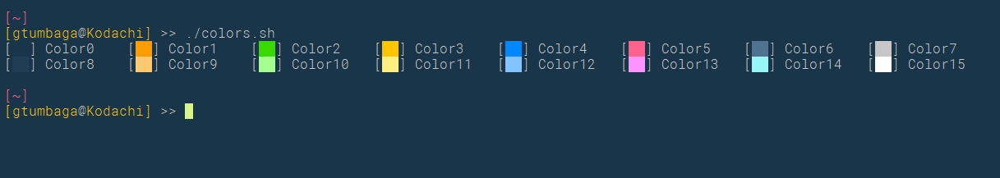

# gConfig
#### These are my various configs, dotFiles, and color themes.

note: this is meant to be cloned to your home directory in ~/gConfig/

This is important becaus the .vimrc file will check and create a symlink form ~/gConfig/g16.vim to ~/.vim/colors/g16.vim if it doesn't exist.


---
## .vimrc and .tmux.conf
Symlink these files from the gConfig dir to your home dir.

## .bashrc_additions
Add this to our .bashrc or .bash_profile file:
```bash
source ~/gConfig/.bashrc_additions
```

## Colors
Please note that the g16.vim color scheme is meant to look with my custom terminal color scheme.  I've included an iterm and terminal (mac) file to import the colors to your terminal.


